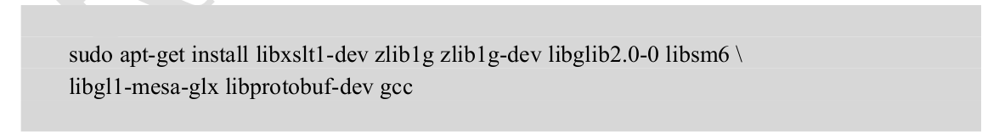

# RKNN2588

### 环境配置

- 下载rknn3588的sdk https://www.t-firefly.com/doc/download/161.html

在下载的sdk包中rknn-toolkit2以及rknpu2（这个部分后续再讲）。rknn-toolkit2中包含以下几个部分：
    - doc：文档以及requirements.txt
    - docker：docker开发所提供的镜像环境
    - examples：开发时所用到的示例
    - packages：rknn的whl文件

- 安装环境
    - conda create -n rknn python=3.6 创建虚拟环境
    - pip install -r requirements.txt 安装依赖包
    - sudo apt-get install libxslt1-dev zlib1g zlib1g-dev libglib2.0-0 libsm6 libgl1-mesa-glx libprotobuf-dev gcc 这一点在官方文档中提到
    
    - pip install rknn.whl 安装rknn的whl包 最终测试成功
    

### 模型转换

采用yolov8的官方权重导出onnx模型进行rknn的模型转换（文档API）

- 将yolov8n.pt转换为yolov8n.onnx模型（参考v8的官方文档）
- 将yolov8.onnx模型转换为rknn格式 这里采用的是没有进行量化的模型转换，量化版本后续提到（yolov8/python/onnx2rknn.py）
  - 使用的SDK包在buikd时，不要设置，尽量不要去设置剪裁网络的操作
  - 转化onnx时算子库版本需要小于等于12
    

### 推理测试

文档API

- 在Ubuntu上模拟环境时，需要load+build（导出模型与推理一体），而不是直接load_rknn
- 在infer时，传入列表并注意数据的通道顺序
